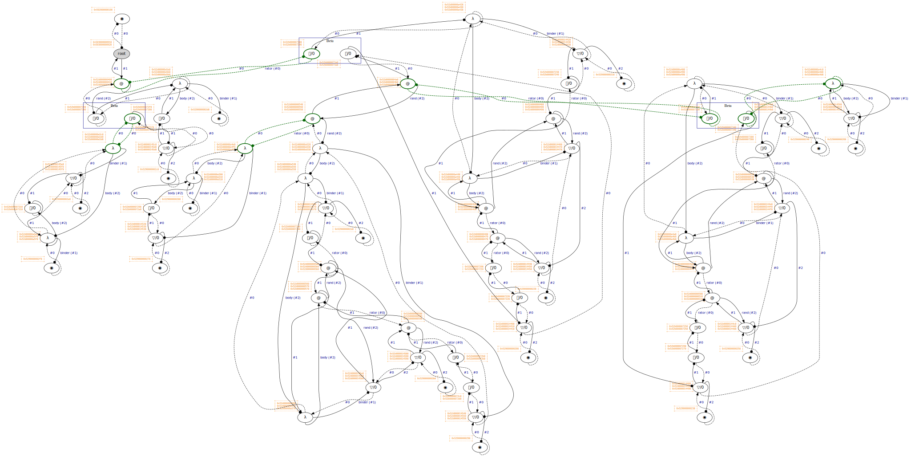

# 🔬 Optiscope

🚧 **WORK IN PROGRESS**

_Optiscope_ is an ~~efficient~~ (not yet), Lévy-optimal implementation of the pure lambda calculus endowed with native function calls, if-then-else expressions, & a fixed-point operator.

Being the first public implementation of [Lambdascope] [^lambdascope] written in portable C99, it is also the first interaction net reducer capable of calling user-provided functions at native speed. Such a seemingly unnatural combination opens a new specialized programming paradigm suited for problems exhibiting both structural sharing & computational intensitie.

[Lambdascope]: https://citeseerx.ist.psu.edu/document?repid=rep1&type=pdf&doi=61042374787bf6514706b49a5a4f0b74996979a0

In what follows, we briefly explaine what it means for reduction to be Lévy-optimal, & then describe our results.

_To every person to informe me of a semantic bug, I will pay $1000 in Bitcoin. More details [here](#bountie-policy)._

## On optimalitie

Following the classical example (here borrowed from [^lamping]):

```
((λg. (g (g (λx. x))))
 (λh. ((λf. (f (f (λz. z))))
       (λw. (h (w (λy. y)))))))
```

This term containes two redexes: the outer redex `((λg. ...) (λh. ...))` & the inner redex `((λf. ...) (λw. ...))`.

If the outer redex is to be reduced first, which follows the normal order reduction strategy, the term will reduce in a single step to (`G` is a metavariable):

```
G := (λh. ((λf. (f (f (λz. z))))
          (λw. (h (w (λy. y))))))
(G (G (λx. x)))
```

which will cause duplication of the inner redex `((λf. ...) (λw. ...))`, thereby entailing duplication of work.

On the other hand, if we follow the applicative order strategy, then four instances of the redex `(h (w (λy. y)))` will need to be processed independently, again entailing duplication of work:

<details>
<summary>Show the full reduction</summary>

```
((λg. (g (g (λx. x))))
 (λh. ((λf. (f (f (λz. z))))
       (λw. <(h (w (λy. y)))>))))

↓ [f/F]

F := (λw. <(h (w (λy. y)))>)
((λg. (g (g (λx. x))))
 (λh. (F (F (λz. z)))))

↓ [(λz. z)/w]

((λg. (g (g (λx. x))))
 (λh. (F <(h ((λz. z) (λy. y)))>)))

↓ [(λy. y)/z]

((λg. (g (g (λx. x))))
 (λh. (F <(h (λy. y))>)))

↓ [<(h (λy. y))>/w]

((λg. (g (g (λx. x))))
 (λh. <(h (<(h (λy. y))> (λy. y)))>))

↓ [g/G]

G := (λh. <(h (<(h (λy. y))> (λy. y)))>)
(G (G (λx. x)))

↓ [(λx. x)/h]

(G <((λx. x) (<((λx. x) (λy. y))> (λy. y)))>)

↓ [(λy. y)/x]

(G <((λx. x) (<(λy. y)> (λy. y)))>)

↓ [(λy. y)/y]

(G <((λx. x) <(λy. y)>)>)

↓ [(λy. y)/x]

(G <<(λy. y)>>)

↓ [<<(λy. y)>>/h]

<(<<(λy. y)>> (<(<<(λy. y)>> (λy. y))> (λy. y)))>

↓ [(λy. y)/y]

<(<<(λy. y)>> (<<<(λy. y)>>> (λy. y)))>

↓ [(λy. y)/y]

<(<<(λy. y)>> <<<(λy. y)>>>)>

↓ [<<<(λy. y)>>>/y]

<<<<<<(λy. y)>>>>>>
```

</details>

In this case, the cause of redundant work is the _virtual redex_ `(h (w (λy. y)))`: when `w` & `h` are instantiated with their respective values, we obtaine the same term `((λy. y) (λy. y))`, which applicative order reduction is not able to detect.

A simpler example to illustrate the principle would be (taken from chapter 2 of [^optimal-implementation]):

```
once = (λv. v)
twice = (λw. (w w))
M = ((λx. x once) (λy. twice (y z)))
```

Proceeding with applicative order reduction:

```
((λx. x once) (λy. twice (y z)))

↓ [(y z)/w]

((λx. x once) (λy. (y z) (y z)))

↓ [(λy. (y z) (y z))/x]

((λy. (y z) (y z)) once)

↓ [once/y]

((once z) (once z))

↓ [z/v]

(z (once z))

↓ [z/v]

(z z)
```

First, the (neutral) application `(y z)` is duplicated; however, later `y` is instantiated with `once`, which makes `(y z)` a redex. Thus, even if some application is not reducible at the moment, it may become reducible later on, so duplicating it would not be optimal. Ideally, both _explicit_ & _virtual_ redexes should be shared; applicative order shares onely explicit redexes, while normal order does not share any.

As also discussed in [^lamping] & [^optimal-implementation], the technique of graph reduction, sometimes termed _lazy evaluation_, is also not optimal: while it postpones copying the redex argument initially, it must copy a term participating in a redex, whenever the former happens to be shared. Consider the following term (adapted from section 2.1.1 of [^optimal-implementation]):

```
((λx. (x y) (x z)) (λw. ((λv. v) w)))
```

After the outermost reduction `((λx. ...) (λw. ...))` is complete, the two occurrences of `(λw. ((λv. v) w))` are now shared through the same parameter `x`. However, as this shared part is participating in both `((λw. ((λv. v) w)) y)` & `((λw. ((λv. v) w)) z)` simultaneously, it must be copied for the both redexes, lest substitution in either redex should affect the other one. In doing so, graph reduction also copies the redex `((λv. v) w)`, thereby duplicating work.

_Optimal evaluation_ (in Lévy's sense [^levy-thesis] [^levy-optimal-reductions]) is a technique of reducing lambda terms to their normal forms, in practice done through so-called _interaction nets_, which are graphs of special symbols & unconditionally local rewriting rules. To reduce a lambda term, an optimal evaluator (1) translates the term to an interaction net, (2) applies a number of interactions (rewritings) in a non-deterministic order, & (3) when no more rules can be applied, translates the resulting net back to the syntactical universe of the lambda calculus. Unlike the other discussed techniques, it performes no copying whatsoever, thereby achieving _maximal sharing_ of redexes.

In practice, this is how an interaction net looks like:

<div align="center">
  
</div>

(Green nodes are "active" nodes, i.e., those that interact with each other.)

Each edge has its own symbol: one of `@`, `λ`, `◉`, `▽/i`, `⌒/i`, or `S` (which appears later during read-back), where `i` is an unsigned "index" that can change during interaction. The first two symbols, `@` & `λ`, have the expected meaning; the other symbols are used for bookkeeping work. Among those, the most important one is `▽/i`, which shares a single piece of a graph between two other edges. Sharing edges can be nested arbitrarily deep, allowing for sharing of an arbitrary number of redexes.

For an evaluator to be optimal, it must satisfie the following properties:
 1. The normal form, if it exists, is always reached.
 2. The normal form, if it exists, is reached in a _minimum number of beta reductions_.
 3. Redexes of the same origin are shared & reduced in a single step.
 4. No unneeded redexes are ever reduced.

Optiscope operates in **five discrete phases**: (1) weak reduction, (2) full reduction, (3) unwinding, (4) scope removal, & (5) loop cutting. The first two phases performe interaction net reduction; the latter phases read back the reduced net into a net that can be directly interpreted as a lambda calculus expression. Weak reduction achieves true Lévy-optimalitie by reducing onely needed interactions (i.e., not touching interactions whose result will be discarded); the latter phases are to be understood as "extensions" that are not formally Lévy-optimal. In particular, full reduction is neither guaranteed to reach beta normal forms, neither it is guaranteed to reduce onely needed interactions. This choice is made of practical concerns, since implementing full Lévy-optimal reduction is neither easy, nor necessary, since all functional machines in practice are weak anyways.

Mathematically, our implementation follows the Lambdascope formalism [^lambdascope], which is perhaps the simplest (among many others) proposal to optimalitie, involving onely six types of nodes & three rule schemes. As here we make no attempt at giving optimalitie a formal treatment, an interested reader is invited to read the paper for more details & ask any related questions in the issues.

## Benchmarks

<details>
<summary>System information</summary>

```
                          ./+o+-       etiams@etiams
                  yyyyy- -yyyyyy+      OS: Ubuntu 24.04 noble
               ://+//////-yyyyyyo      Kernel: x86_64 Linux 6.8.0-60-generic
           .++ .:/++++++/-.+sss/`      Uptime: 16m
         .:++o:  /++++++++/:--:/-      Packages: 2799
        o:+o+:++.`..```.-/oo+++++/     Shell: bash 5.2.21
       .:+o:+o/.          `+sssoo+/    Resolution: 3840x2400
  .++/+:+oo+o:`             /sssooo.   DE: GNOME 46.7
 /+++//+:`oo+o               /::--:.   WM: Mutter
 \+/+o+++`o++o               ++////.   WM Theme: Adwaita
  .++.o+++oo+:`             /dddhhh.   GTK Theme: Yaru-red [GTK2/3]
       .+.o+oo:.          `oddhhhh+    Icon Theme: Yaru-red
        \+.++o+o``-````.:ohdhhhhh+     Font: Ubuntu Sans Bold 11 @wght=700
         `:o+++ `ohhhhhhhhyo++os:      Disk: 389G / 484G (85%)
           .o:`.syhhhhhhh/.oo++o`      CPU: AMD Ryzen 9 5900HX with Radeon Graphics @ 16x 4.68GHz
               /osyyyyyyo++ooo+++/     GPU: AMD/ATI Cezanne [Radeon Vega Series / Radeon Vega Mobile Series]
                   ````` +oo+++o\:     RAM: 5849MiB / 15388MiB
                          `oo++.
```

</details>

Note: the benchmarks are many times slower than those in [`benchmarks-haskell/`](benchmarks-haskell/). Investigate the cause.

### [Ackermann of (3, 3)](benchmarks/ackermann-of-3-3.c)

```
Benchmark 1: ./ackermann-of-3-3
  Time (mean ± σ):     20.125 s ±  0.157 s    [User: 20.108 s, System: 0.016 s]
  Range (min … max):   19.917 s … 20.333 s    5 runs
```

<details>
<summary>Interactions count</summary>

```
Annihilation interactions: 73115
Commutation interactions: 705892
Beta interactions: 8
Native function calls: 7232
If-then-elses: 3668
Fixpoints: 4
Total interactions: 789919
```

</details>

### [Church lists](benchmarks/church-list-reverse-and-sum.c)

```
Benchmark 1: ./church-list-reverse-and-sum
  Time (mean ± σ):      8.755 s ±  0.059 s    [User: 7.115 s, System: 1.639 s]
  Range (min … max):    8.685 s …  8.832 s    5 runs
```

<details>
<summary>Interactions count</summary>

```
Annihilation interactions: 18150009
Commutation interactions: 234498068
Beta interactions: 30006
Native function calls: 6000
If-then-elses: 0
Fixpoints: 0
Total interactions: 252684083
```

</details>

### [Scott list insertion sort](benchmarks/scott-insertion-sort.c)

```
Benchmark 1: ./scott-insertion-sort
  Time (mean ± σ):     10.847 s ±  0.133 s    [User: 10.176 s, System: 0.669 s]
  Range (min … max):   10.663 s … 11.037 s    5 runs
```

<details>
<summary>Interactions count</summary>

```
Annihilation interactions: 20141278
Commutation interactions: 153044768
Beta interactions: 21017
Native function calls: 10100
If-then-elses: 4950
Fixpoints: 6
Total interactions: 173222119
```

</details>

### [Scott trees](benchmarks/scott-tree-map-and-sum.c)

```
Benchmark 1: ./scott-tree-map-and-sum
  Time (mean ± σ):      3.416 s ±  0.005 s    [User: 2.731 s, System: 0.684 s]
  Range (min … max):    3.410 s …  3.422 s    5 runs
```

<details>
<summary>Interactions count</summary>

```
Annihilation interactions: 13418351
Commutation interactions: 88284603
Beta interactions: 294914
Native function calls: 65534
If-then-elses: 0
Fixpoints: 6
Total interactions: 102063408
```

</details>

## Implementation details

 - **Node layout.** We interpret each graph node as an array `a` of `uint64_t` values. At position `a[-1]`, we store the _node symbol_; at `a[0]`, we store the principal port; at positions from `a[1]` to `a[3]` (inclusively), we store the auxiliary ports; at positions starting from `a[4]`, we store additional data elements, such as function pointers or computed cell values. The number of auxiliary ports & additional data elements determines the total size of the array: for erasers, the size in bytes is `2 * sizeof(uint64_t)`, as they need one position for the symbol & another one for the principal port; for applicators & lambdas having two auxiliary ports, the size is `3 * sizeof(uint64_t)`; for unary function calls, the size is `4 * sizeof(uint64_t)`, as they have one symbol, two auxiliary ports, & one function pointer. Similar calculation can be done for all the other node types.

 - **Symbol layout.** The difficultie of representing node symbols is that they may or may not have indices. Therefore, we employ the following scheme: `0` is the root symbol, `1` is the garbage symbol, `2` is an applicator, `3` is a lambda, `4` is an eraser, `5` is a scope (which appears onely during read-back), & so on until value `11`, inclusively; now the next `9223372036854775802` values are occupied by duplicators, & the same number of values is then occupied by delimiters. Together, all symbols occupy the full range of `uint64_t`; the indices of duplicator & delimiter symbols can be determined by proper subtraction.

 - **Port layout.** Modern x86-64 CPUs utilize the 48-bit address space, leaving 16 highermost bits unused (i.e., sign-extended). We therefore utilize the highermost 2 bits for the port offset (relative to the principal port), & then 4 bits for the algorithm phase, which is either `PHASE_WEAK_REDUCTION = 0`, `PHASE_FULL_REDUCTION = 1`, `PHASE_UNWIND = 2`, `PHASE_SCOPE_REMOVE = 3`, `PHASE_LOOP_CUT = 4`, or `PHASE_GARBAGE = 5`. The following bits represent a (sign-extended) address of the port to which the current port is connected to. This layout is particularly space- & time-efficient: given any port address, we can retrieve the principal port address & from there go to any neighbouring node in constant time; given a phase, we avoid the need for history lookups during graph traversals. (The phase value is onely encoded in the principal port; all consequent ports have their phases zeroed out.) The onely drawback of this approach is that ports need to be encoded when being assigned & decoded before being used.

 - **O(1) memory management.** We have implemented a custom [pool allocator] that has constant-time asymptotics for allocation & deallocation. For each node type, we have a separate global pool instance to avoid memory fragmentation. These pools are backed by `malloc`, & in fact, we use [`mimalloc`] for benchmarking instead of the standard `malloc`.

[pool allocator]: https://en.wikipedia.org/wiki/Memory_pool
[`mimalloc`]: https://github.com/microsoft/mimalloc

 - **Weak reduction.** In real situations, the result of pure lazy computation is expected to be either a constant value or a top-level constructor. Even when one seeks reduction under binders & other constructors, one usually also wants [controlling definition unfoldings] or reusing already performed unfoldings [^taming-supercompilation] to keep resulting terms manageable. We therefore adopt BOHM-style _weak reduction_ [^bohm] as the initiall phase of our algorithm. Weak reduction repeatedly reduces the _leftmost outermost_ interaction until a lambda node is connected to the current _apex node_, the latter being either the root node or a delimiter node connected to the previous apex. This phase directly implements Lévy-optimal reduction by performing onely needed work, i.e., avoiding to work on an interaction whose result will be discarded later.<br>(A shocking side note: per section "5.6 Optimal derivations" of [^optimal-implementation], a truly optimal machine must necessarily be sequential, because otherwise, the machine risks at working on unneeded interactions!)

 - **Garbage collection.** This peculiar scenario can occur during interaction net evaluation: whole graph components may become fully disconnected from the root node, such as when a lambda application rejects its argument or when an if-then-else node selects the correct branch, rejecting the other one. In order to avoid memory leaks during weak reduction & reducing disconnected components during full reduction, we implement a form of mark & sweep garbage collection. When our algorithm determines that a node _may_ have become disconnected, it launches the mark procedure, which traces the node's path to the root, setting `PHASE_GARBAGE` on all encountered nodes. Now two scenarios may occur: either the root is eventually found or not. In the first case, the sweep procedure recovers all changed nodes' phases to the current phase; in the other case, it attempts to free seen nodes.

 - **Garbage nodes.** We utilize the `SYMBOL_GARBAGE` symbol to mark garbage nodes, i.e., those freed during garbage collection or normally after an interaction. If garbage collector's decision was to free an active node during full reduction or read-back, it would not be able to remove the node from the corresponding multifocus, causing a use-after-poison bug later when the node is about to interact. We therefore do not free active nodes during garbage collection, but instead delay garbage collection to the point when the active garbage node is encountered during multifocus consumption. However, during weak reduction, we simply decide to free active nodes unconditionally, because the initiall phase onely focuses on one node at a time.

 - **Multifocusing.** During full reduction & read-back: instead of focusing on onely one interaction at a time & then traversing the graph to find the next interaction, we have implemented a special data structure in which we record newly activated nodes as we performe the current interaction. The data structure is essentially an array of nodes of a statically chosen size (defaulting to 1 MB) + the fallback linked list + the total count of nodes in the data structure. We maintaine a number of separate multifocuses for each interaction type, which together comprise the global "context" of full interaction net normalization. We thus proceed with normalization until all these multifocuses are emptied out, i.e., until we have no more rules to performe.

 - **Graphviz intergration.** Debugging interaction nets is a particularly painfull exercise. Isolated interactions make very little sense, yet, the cumulative effect is somehow analogous to conventional beta reduction. To simplifie the challenge a bit, we have integrated [Graphviz] (in debug mode onely) to display the whole graph before each interaction. In addition to visualizing the graph itself, we have the option to display blue-coloured "clusters" of nodes that originated from the same interaction (either commutation or Beta). The latter option is particularly helpfull, but it is viable onely for small graphs, & onely as long as computation did not go too far. Our visualization also displays an ASCII table of port addresses alongside each node, which has proven to be extremely helpfull in debugging various memory management issues in the past.

[controlling definition unfoldings]: https://andraskovacs.github.io/pdfs/wits24prez.pdf
[Graphviz]: https://graphviz.org/

## Closing thoughts

I was struggling with the implementation for about a month of very active work. The Lambdascope paper gives onely a very general guidance for implementing the algorithm, but skips over many important technical details, among which is the crucial part responsible for garbage collection. While it is mentioned in the paper that eraser nodes are in charge of collecting garbage, I could not find any mention of the peculiar situation where a single connected graph may become disconnected after a Beta step. My task was therefore not to merely translate the paper specification into an executable C program, but to reconstruct the algorithm from a very blurry description. (In particular, properly managing disconnected graph components eventually required a form of mark & sweep garbage collection.)

What I find most missing is the actuall prototype implementation mentioned in the paper, which the authors did not seem to disclose to the public:

> A prototype implementation, which we have dubbed _lambdascope_, shows that out-of-the-box, our calculus performs as well as the _optimized_ version of the reference optimal higher-order machine BOHM (see [2]) (hence outperforms the standard implementations of functional programming languages on the same examples as BOHM does).

Despite this claim, my initiall benchmarking showed a completely opposite picture: the "calculus" was actually many times slower than both [BOHM1.1] & the standard normalization-by-evaluation algorithm [written in OCaml]. In despair, I reached out to the authors with the hope of getting access to their prototype implementation, but did onely receive what looked like an automatic reply. After some more investigation, it was eventually revealed to me that the read-back phases should not be included in benchmarking, as BOHM is itself a weak machine, meaning that it neither reduces under lambdas, nor reads back the resulting term; wherefore my conjecture is that the authors did onely benchmark initiall graph rewritings -- until some graph normal form is reached (which may or may not include reductions under binders). However, we can never be certain about it, unless the prototype implementation is made public.

[BOHM1.1]: https://github.com/asperti/BOHM1.1
[written in OCaml]: https://gist.github.com/etiams/25326a0a40778fd141882174c7e31786

Finally, I did not have success in compiling the existing implementations of Lambdascope in Haskell:
 - [`LambdaINet`](https://hackage.haskell.org/package/LambdaINet)
 - [`graph-rewriting-lambdascope`](https://hackage.haskell.org/package/graph-rewriting-lambdascope)

Both packages require very outdated dependencies, & I am not a person quite familiar with fixing Haskell dependency conflicts. Reading sources in Haskell is far from a pleasant exercise for me either.

## Commands

 - `./command/test.sh` -- run the test suite `tests.c`.
 - `./command/bench.sh` -- run all the benchmarks in `benchmarks/` (you can tune the parameters in the script).
 - `./command/graphviz-state.sh` -- visualize `target/state.dot` as `target/state.dot.svg`.
 - `./command/graphvis-all.sh` -- visualize all the `.dot` files in `target/`.

## Relevant research

 - Asperti, Andrea, Cecilia Giovannetti, and Andrea Naletto. "The Bologna optimal higher-order machine." Journal of Functional Programming 6.6 (1996): 763-810.
 - Lafont, Yves. "Interaction combinators." information and computation 137.1 (1997): 69-101.
 - Mackie, Ian. "YALE: Yet another lambda evaluator based on interaction nets." Proceedings of the third ACM SIGPLAN international conference on Functional programming. 1998.
 - Pedicini, Marco, and Francesco Quaglia. "A parallel implementation for optimal lambda-calculus reduction." Proceedings of the 2nd ACM SIGPLAN international conference on Principles and practice of declarative programming. 2000.
 - Pinto, Jorge Sousa. "Weak reduction and garbage collection in interaction nets." Electronic Notes in Theoretical Computer Science 86.4 (2003): 625-640.
 - Mackie, Ian. "Efficient λ-evaluation with interaction nets." International Conference on Rewriting Techniques and Applications. Berlin, Heidelberg: Springer Berlin Heidelberg, 2004.
 - Mackie, Ian. "Encoding strategies in the lambda calculus with interaction nets." Symposium on Implementation and Application of Functional Languages. Berlin, Heidelberg: Springer Berlin Heidelberg, 2005.
 - Hassan, Abubakar, Ian Mackie, and Shinya Sato. "Compilation of interaction nets." Electronic Notes in Theoretical Computer Science 253.4 (2009): 73-90.
 - Hassan, Abubakar, Ian Mackie, and Shinya Sato. "An implementation model for interaction nets." arXiv preprint arXiv:1505.07164 (2015).
 - Biernacka, Małgorzata, Witold Charatonik, and Tomasz Drab. "A simple and efficient implementation of strong call by need by an abstract machine." Proceedings of the ACM on Programming Languages 6.ICFP (2022): 109-136.
 - Daniel Augusto Rizzi Salvadori. (2025). Δ-Nets: Interaction-Based System for Optimal Parallel λ-Reduction.

For readers unfamiliar with interaction nets, we recommend the originall Lafont's paper:
 - Lafont, Yves. "Interaction nets." Proceedings of the 17th ACM SIGPLAN-SIGACT symposium on Principles of programming languages. 1989.

## Bountie policy

Optiscope is aimed at being _as correct as possible_, with regards to the Lambdascope specification & the general understanding of the lambda calculus. To back up this endeavour financially, **any person to discover a semantic bug will get a $1000 bountie in Bitcoin**. A semantic bug constitutes a situation when some input lambda term is either reduced to an incorrect result, or the algorithm does not terminate. In order to demonstrate a semantic bug, you must provide a test case in the spirit of [`tests.c`] & show how your term would reduce normally. (Non-termination bugs are the trickiest, because it might be unclear if the machine is just inefficient or it is falling in a cycle. In order to prove your case, it might be necessary to pinpoint the _cause_ of non-termination, instead of merely the _fact_ of it.)

In addition to semantic bugs, there are various memory management issues that plague programs written in C. For any such issue, a reporter will get a **$100 bountie in Bitcoin**. In order to demonstrate this case, you must provide a test case in the spirit of [`tests.c`] that our `-fsanitize=address`-built executable test suite will fail to pass.

[`tests.c`]: tests.c

In order to report either type of a bug, kindly open an issue in this repository. If your case meets the eligibilitie criteria, I will ask for your email address & reach out to you as soon as possible. In case of any ambiguitie, I will use my best judgement.

Semantic bugs related to extra functionalitie like native function calls & if-then-else nodes are not eligible for bountie, as they exist outside the realm of the pure lambda calculus.

## References

[^lamping]: Lamping, John. "An algorithm for optimal lambda calculus reduction." Proceedings of the 17th ACM SIGPLAN-SIGACT symposium on Principles of programming languages. 1989.

[^lambdascope]: van Oostrom, Vincent, Kees-Jan van de Looij, and Marijn Zwitserlood. "Lambdascope: another optimal implementation of the lambda-calculus." Workshop on Algebra and Logic on Programming Systems (ALPS). 2004.

[^optimal-implementation]: Asperti, Andrea, and Stefano Guerrini. The optimal implementation of functional programming languages. Vol. 45. Cambridge University Press, 1998.

[^levy-thesis]: Lévy, Jean-Jacques. Réductions correctes et optimales dans le lambda-calcul. Diss. Éditeur inconnu, 1978.

[^levy-optimal-reductions]: Lévy, J-J. "Optimal reductions in the lambda calculus." To HB Curry: Essays on Combinatory Logic, Lambda Coalculus and Formalism (1980): 159-191.

[^bohm]: Asperti, Andrea, Cecilia Giovannetti, and Andrea Naletto. "The Bologna optimal higher-order machine." Journal of Functional Programming 6.6 (1996): 763-810.

[^taming-supercompilation]: Jonsson, Peter A., and Johan Nordlander. "Taming code explosion in supercompilation." Proceedings of the 20th ACM SIGPLAN workshop on Partial evaluation and program manipulation. 2011.
